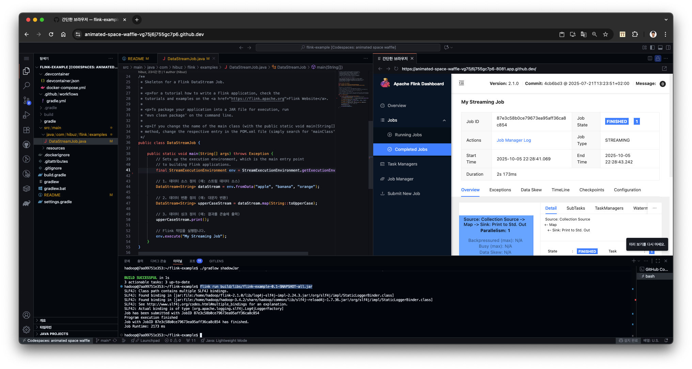

# A Flink application project using Java and Gradle.


## Building and running
To run and test your application with an embedded instance of Flink
```bash
./gradlew run
```
To package your job for submission to Flink,
```bash
./gradlew shadowJar
```
Afterwards, you'll find the jar to use in the 'build/libs' folder.

To run in cluster mode
```bash
flink run build/libs/*-all.jar
```

Visit dashboard : http://localhost:8081


### References
- https://nightlies.apache.org/flink/flink-docs-stable/